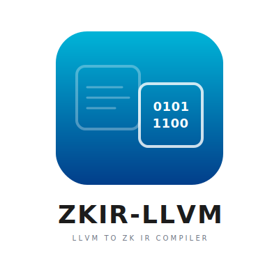

<p align="center">
  
</p>

LLVM IR to ZK IR translator - enables any language with an LLVM frontend (Rust, C, C++, Go, Swift, etc.) to compile programs that can be proven in zero-knowledge.

## Overview

This project creates a translator that converts LLVM IR (Intermediate Representation) into ZK IR bytecode. This enables zero-knowledge proof generation for programs written in any LLVM-supported language.

**Dependency**: This project depends on `zkir-spec` from https://github.com/seceq/zkir

## Features

- Parse LLVM IR text format (`.ll` files)
- Translate LLVM instructions to ZK IR instructions
- Handle memory layout and calling conventions
- Optimize output for minimal constraint count
- Support incremental/modular translation

## Installation

```bash
# Clone the repository
git clone https://github.com/seceq/zkir-llvm
cd zkir-llvm

# Build
cargo build --release
```

## Usage

### Translate LLVM IR to ZK IR

```bash
# Basic usage
zkir-llvm translate input.ll -o output.zkbc

# With optimization
zkir-llvm translate input.ll -o output.zkbc -O2

# Verbose output
zkir-llvm translate input.ll -o output.zkbc --verbose
```

### Check LLVM IR validity

```bash
zkir-llvm check input.ll
```

### Dump parsed IR

```bash
# Text format
zkir-llvm dump input.ll

# JSON format
zkir-llvm dump input.ll --format json
```

## LLVM IR to ZK IR Mapping

### Arithmetic Operations

| LLVM IR | ZK IR | Notes |
|---------|-------|-------|
| `add i32 %a, %b` | `ADD dst, src1, src2` | Direct mapping |
| `sub i32 %a, %b` | `SUB dst, src1, src2` | Direct mapping |
| `mul i32 %a, %b` | `MUL dst, src1, src2` | Direct mapping |
| `udiv i32 %a, %b` | `DIV dst, src1, src2` | Unsigned division |
| `sdiv i32 %a, %b` | `SDIV dst, src1, src2` | Signed division |

### Control Flow

| LLVM IR | ZK IR | Notes |
|---------|-------|-------|
| `br label %bb` | `JMP target` | Unconditional branch |
| `br i1 %cond, label %t, label %f` | `BNE` + `JMP` | Conditional branch |
| `ret i32 %v` | `MOV r1, src` + `RET` | Return value in r1 |
| `call @func(...)` | `CALL target` | Args in r4-r7 |

## License

MIT OR Apache-2.0
